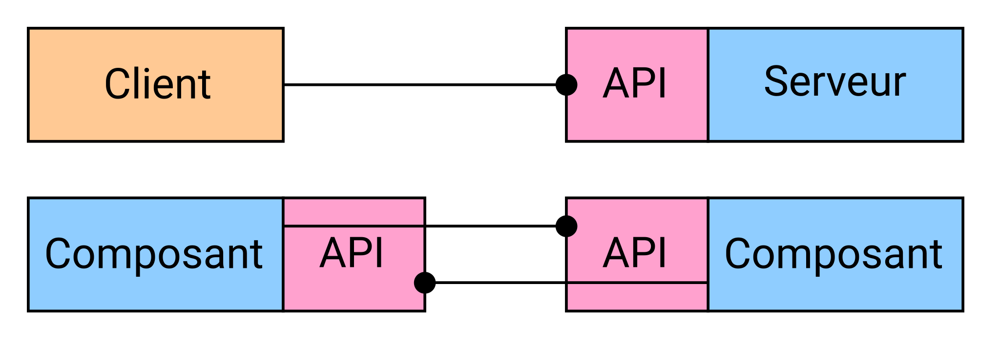
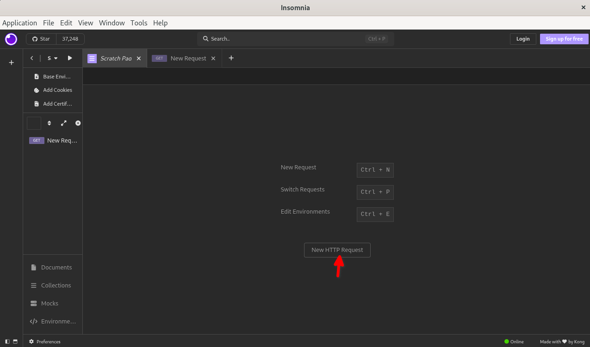
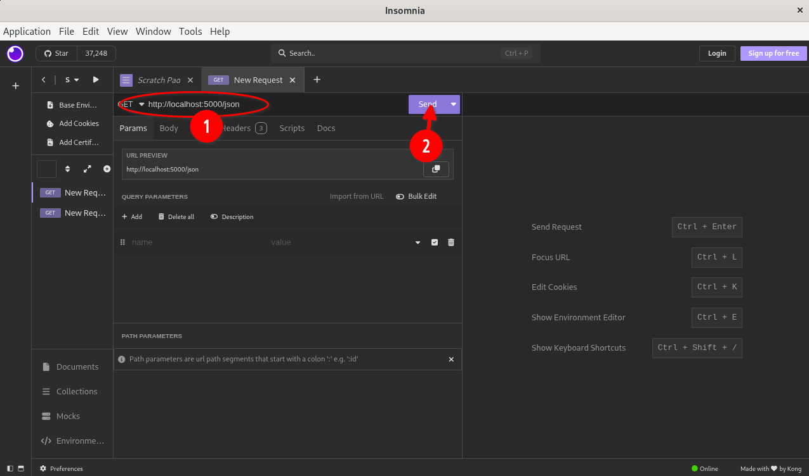
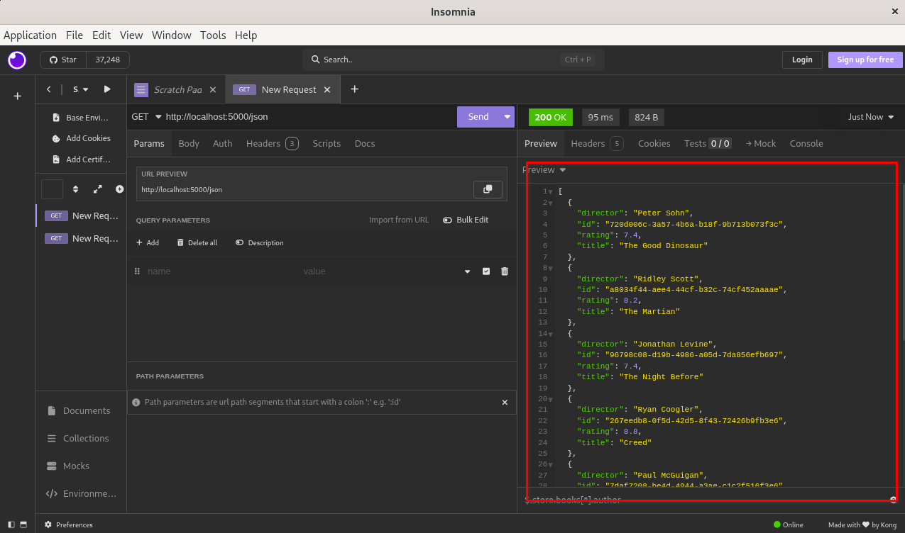

<style>
iframe {
	height:300px;
}
</style>

1. TOC
{:toc}

# Avant de démarrer
*(Adapté du cours d'[Hélène COULLON](https://helene-coullon.fr/) ( MA, HDR, IMT Atlantique) « [UE Architectures Distribuées FIL A1 2025-2026 - IMT Atlantique](https://helene-coullon.fr/pages/ue-ad-25-26/) », Section « [REST - Pdf du cours sur REST](https://helene-coullon.fr/download/teachings/ue-ad/cours-25-26/2-api-rest.pdf) »)*

Dans cette session dédiée aux API REST, avant d'attaquer la pratique, nous allons passer en revue les concepts de base essentiels pour bien comprendre l'environnement dans lequel évoluent les API REST. Ces bases théoriques sont primordiales pour appréhender sérieusement la conception et l’utilisation d’API REST, notamment lorsqu’on cherche à automatiser ou interconnecter des services.


## Rappels sur HTTP

**HyperText Transfer Protocol (HTTP)** est le protocole fondamental qui sous-tend la communication sur le web. Développé en 1989 par Tim Berners-Lee au CERN, il constitue, avec HTML et les URI, la base du World Wide Web.

HTTP opère à la couche **application** du modèle OSI et fonctionne selon le modèle **client/serveur**. Concrètement, cela signifie qu’un client (typiquement votre navigateur ou un client HTTP comme `curl`) envoie une requête à un serveur. Le serveur analyse cette requête, puis renvoie une réponse. Ce dialogue se fonde sur des règles très précises, standardisées, qui permettent l’interopérabilité entre des systèmes très variés, écrits dans des langages différents.

HTTP n’est pas seulement utilisé pour consulter des pages web, mais aussi comme "langue commune" pour tous les logiciels qui doivent échanger des données sur Internet, tout particulièrement dans le domaine des API REST.


## Les méthodes de HTTP

Une requête HTTP typique est constituée de trois éléments principaux :

- **Ligne de requête** : elle indique la méthode voulue, la ressource ciblée (URL) et la version du protocole, par exemple  
  `GET /api/v1/films HTTP/1.1`
- **En-têtes** (headers) : informations optionnelles accompagnant la requête, comme les identifiants de session ou le type de contenu.
- **Corps** (body) : optionnel, présent principalement pour envoyer des données au serveur (par exemple, avec POST ou PUT).

Les **méthodes** HTTP les plus courantes sont :

- **GET** : Demande de récupérer une ressource (typiquement, consulter une page ou obtenir un enregistrement).
- **POST** : Envoi d'informations au serveur (souvent pour créer une nouvelle entité).
- **PUT** : Envoi de données pour mise à jour ou remplacement d'une ressource existante.
- **DELETE** : Demande de suppression d’une ressource.

Dans la conception d'une API REST, savoir choisir la bonne méthode HTTP, et bien comprendre leur sémantique, est essentiel pour obtenir un système robuste et intuitif.


## Les versions de HTTP

L’évolution du protocole HTTP a suivi les évolutions du web.

### HTTP/0.9 (1991)
- C’était une version très rudimentaire, qui permettait uniquement de récupérer le contenu HTML d’une page via GET.
- Après chaque réponse, la connexion était systématiquement fermée côté serveur, ce qui a entraîné des surcoûts pour créer/établir une nouvelle connexion TCP pour chaque requête.

### HTTP/1.0 (1996)
- Introduction du support de tout type de fichier (images, PDF...).
- La connexion TCP/IP était toujours fermée après chaque réponse (problème des surcoûts TCP pas encore réglé).

### HTTP/1.1 (1997)
- Grande avancée ! La connexion peut être maintenue ouverte ("keep-alive"), ce qui permet plusieurs échanges successifs sans se reconnecter à chaque fois.
- Introduction du **pipelining** (envoi de plusieurs requêtes avant d’avoir les réponses).
- Nouvelles méthodes comme POST ou PUT.
- Gestion du caching...
- Amélioration de la performance globale des échanges web.

### HTTP/2 (2015)
- Passage à un format binaire (plus efficace et compact qu’un échange strictement textuel).
- Prise en charge native de requêtes parallèles (multiplexing).
- Compression des en-têtes, réduisant la consommation de bande passante.
- Fonction PUSH : le serveur peut envoyer proactivement des ressources au client avant même que celui-ci les demande (avant, il était toujours obligatoire pour le **client** de demander s'il y avait quelque chose pour lui).

### HTTP/3 (2022)
- Changement fondamental dans le transport : HTTP/3 utilise UDP à la place de TCP, principalement grâce à QUIC, pour améliorer la rapidité et la résilience des connexions.

En pratique, la majorité des API REST reposent encore sur HTTP/1.1 ou HTTP/2 aujourd'hui.


## Formats JSON et YAML

Pour échanger les données via HTTP, il faut des formats standards, textuels, qui puissent être facilement lus, compris, et manipulés par des programmes, tout en restant lisibles pour un humain. Deux grands formats se sont imposés :

### JSON (JavaScript Object Notation)
- Un format de données basé sur la syntaxe de JavaScript, largement adopté pour sa simplicité et sa lisibilité.
- Très utilisé dans les **requêtes/réponses HTTP** et par les **bases de données NoSQL**.
- Largement supporté par la majorité des langages de programmation.

### YAML (YAML Ain’t Markup Language ; ex Yet Another Markup Language)
- Un format conçu pour être encore plus lisible par l’humain.
- Utilisé principalement pour les **fichiers de configuration** et les **spécifications** (par exemple, dans Kubernetes ou Ansible).
- Peut représenter des structures complexes (listes, dictionnaires imbriqués) de façon concise.

Tous deux sont **sérialisables** : on peut facilement convertir une structure de données en string pour l’envoyer sur le réseau, puis la désérialiser côté récepteur.

Par rapport à XML, ils sont plus légers, moins verbeux, et beaucoup plus agréables à manipuler.


## Exemples JSON et YAML

Voici des exemples concrets pour bien visualiser la syntaxe et la différence entre JSON et YAML.

### Exemple de données JSON - Une ressource "film"
```json
{
  "id": 1,
  "titre": "Inception",
  "realisateur": "Christopher Nolan",
  "annee": 2010,
  "acteurs": ["Leonardo DiCaprio", "Ellen Page", "Joseph Gordon-Levitt"]
}
```

### Exemple de liste JSON - Plusieurs films
```json
[
  {
    "id": 1,
    "titre": "Inception"
  },
  {
    "id": 2,
    "titre": "Interstellar"
  }
]
```

### Exemple YAML équivalent d’un film
```yaml
id: 1
titre: "Inception"
realisateur: "Christopher Nolan"
annee: 2010
acteurs:
  - "Leonardo DiCaprio"
  - "Ellen Page"
  - "Joseph Gordon-Levitt"
```

### Exemple YAML - Liste de films
```yaml
- id: 1
  titre: "Inception"
- id: 2
  titre: "Interstellar"
```

On voit immédiatement que YAML est plus concis, et qu'il n'oblige pas à l’utilisation d’accolades ou de crochets, ce qui facilite la lecture visuelle. Mais les deux formats peuvent représenter exactement les mêmes structures de données.


# API REST

Maintenant que nous avons posé les bases techniques, attaquons le sujet central : les API REST.

## Faire communiquer des composants logiciels

Dans une application moderne, il est rare que tous les composants tournent dans le même processus, ou même sur la même machine. Très souvent, différents services, éventuellement écrits dans des langages distincts ou déployés à différents endroits, doivent **échanger des informations**.

Alors, pourquoi ne pas simplement coder "à la main" la gestion du réseau - ouvrir une socket TCP, envoyer des messages en binaire, etc.? En pratique, ce serait laborieux, source d’erreurs, difficilement maintenable, et chaque composant devrait réinventer la roue.

Pour **abstraire** ces détails, on s’appuie sur des protocoles standard comme HTTP, et sur des **API** bien définies, qui servent de "contrat" entre les composants. L’usage de **bibliothèques** et de **frameworks** adaptés permet de gérer plus facilement la communication, la sérialisation, la sécurité, etc.

Enfin, pour garantir que les composants sachent "comment parler", il faut une spécification claire et partagée des fonctions de l’API : d’où l’importance de documenter son API de façon rigoureuse.


## Qu'est-ce qu'une API ?

**API** signifie *Application Programming Interface*. C’est un ensemble de règles et de conventions qui définit comment utiliser un logiciel, une bibliothèque ou un service en ligne.



Une API, dans ce contexte, représente **un "contrat"** : le serveur annonce quelles opérations il propose (lecture, création, modification, etc) et selon quelles modalités le client peut l’appeler (quelle URL, quelles méthodes HTTP, quelle structure de données).

Par exemple : 
- "Pour obtenir la liste des films, faites : `GET /api/films`"
- "Pour ajouter un film, faites : `POST /api/films` avec le film au format JSON dans le corps"

La notion d'API existe bien au-delà du web, mais dans le domaine des applications distribuées, c'est le protocole HTTP associé à une API REST qui s’est imposé comme standard de communication.


## REST : REpresentational State Transfer

Le concept de REST a été formalisé par Roy Fielding dans sa thèse (2000), dans le but d’exploiter au maximum la **flexibilité** et la **simplicité du web** pour concevoir des logiciels modernes interconnectés.

En quelques principes :
- On pense son application **comme un site web** : chaque type de ressource (film, utilisateur, commande, produit, etc) est identifié par une URL unique.
- Pour interagir avec une ressource, on utilise les **méthodes HTTP** standards (GET, POST, PUT, DELETE...).
- On échange des représentations des ressources (en JSON, YAML ou autre).

L’adresse d’une ressource sert de point d’accès universel. Par exemple :  
`GET http://monapi.example.com/films/42 HTTP/1.1` permet d’obtenir le film d'id 42.

Ce modèle rend les systèmes distribués plus simples à concevoir, à comprendre et à faire évoluer.

Pour un retour aux sources, voir la thèse de Roy Fielding :  
[https://www.ics.uci.edu/~fielding/pubs/dissertation/rest_arch_style.htm](https://www.ics.uci.edu/~fielding/pubs/dissertation/rest_arch_style.htm)


# Tutoriel sur Flask : Implémentation d’un micro-service Movie
*(Adapté du cours d'[Hélène COULLON](https://helene-coullon.fr/) ( MA, HDR, IMT Atlantique) « [UE Architectures Distribuées FIL A1 2025-2026 - IMT Atlantique](https://helene-coullon.fr/pages/ue-ad-25-26/) », Section « [REST - Tutoriel sur Flask](https://helene-coullon.fr/pages/ue-ad-fil-25-26/tuto-flask) »)*

## Objectif

Nous allons ici implémenter une service `Movie` avec `Flask`.

Clonez le repository `git` suivant : 
```text
https://github.com/TeachingAndResearch/ue_web_example_session10-rest.git
```
et passer via le dev containers sur exécution en dev container.

Ce repository contient un la service implémenté dans le TP (le service `Movie` qui nous intéresse ici). Chaque répertoire de service contient les données `json` qui lui sont associées ainsi que la spécification `OpenAPI`.

Le repository, comme indiqué dans le guide d'installation, contient également un fichier `requirements.txt` racine utile pour installer les dépendances nécessaires (à savoir ici les bibliothèques `Flask` et `requests`). Il contient enfin les fichiers nécessaires à la construction de l'environnement Docker, à savoir un fichier `docker-compose.yaml` et dans chaque répertoire un fichier `requirements.txt` et un `Dockerfile`.


## Les bases de notre service Movie

### Création et lecture des données JSON

Le code ci-dessous permet la lecture du fichier JSON `databases/movies.json`. L'objet `movies` récupéré est obtenu en tant que liste (`list`).

```python
import json

with open('{}/databases/movies.json'.format("."), "r") as jsf:
    movies = json.load(jsf)
    print(movies)
```

## Points d'entrée pour obtenir des données

Testez le résultat à chaque étape !

### GET JSON en entier

Créons un point d'entrée retournant le fichier JSON entièrement. Pour cela, nous utilisons la méthode `jsonify` qui permet de créer une réponse HTTP à partir d'un format JSON ([voir la documentation Flask `jsonify`](https://tedboy.github.io/flask/generated/flask.jsonify.html)).

```python
from flask import Flask, jsonify, make_response
import json


@app.route("/json", methods=['GET'])
def get_json():
    res = make_response(jsonify(movies), 200)
    return res
```


### Utilisation d’outils de test : Postman ou équivalent

Il est temps de tester votre service avec [Postman](https://www.postman.com/) ou un équivalent comme [Apidog](https://apidog.com) ou [Insomnia REST](https://insomnia.rest/).

Ces outils permettent de créer des collections de requêtes pour tester facilement les API REST (mais aussi les API GraphQL ou gRPC). Ils proposent aussi des fonctionnalités de documentation ou d’automatisation.

Pour faire une requête POST ou PUT avec un corps JSON, sélectionnez bien le type `raw` puis `JSON` dans l’onglet `Body` de votre requête.





### Postman ou équivalent

Il est temps de tester votre service avec https://www.postman.com/[Postman] ou un équivalent comme (ou votre solution préférée)

- https://apidog.com/[Apidog]
- https://insomnia.rest/[Insomnia REST]

Pour Insomnia, ce n'est pas nécessaire de créer un compte. Sur la page de demarrage de l'application il faut juste choisir:
```text
Or, start right away with limited capabilities
Use local Scratch Pad
```

Vous pouvez dans ce type d'outils créer des collections de requêtes pour tester vos API REST (mais aussi on le verra les API GraphQL et gRPC). Vous pouvez aussi créer des documentations par exemple et d'autres fonctionnalités.

Installez l'un de ces outils et créez une requête pour tester le point d'entrée précédent. Sauvegardez là pour pouvoir facilement la réutiliser.


### GET information d'un film à partir de son ID

L'objet `movies` est une liste (`list`), on peut donc itérer sur ses éléments que nous appelons ici `movie`. Chaque objet `movie` est un dictionnaire. Nous vérifions pour chaque élément si la valeur associée à la clé `"id"` est égale à l'ID recherché. Si tel est le cas, le dictionnaire `movie` courant est retourné.

```python
@app.route("/movies/<movieid>", methods=['GET'])
def get_movie_byid(movieid):
    for movie in movies:
        if str(movie["id"]) == str(movieid):
            res = make_response(jsonify(movie), 200)
            return res
    return make_response(jsonify({"error":"Movie ID not found"}), 404)
```

Vous voyez ici que l'ID est indiqué dans l'adresse directement. C'est la méthode la plus classique en REST pour passer des paramètres. On peut complexifier l'adresse comme on le souhaite, par exemple avec plusieurs paramètres `/entry_point/<val1>/<val2>/<val3>`.


### GET information à partir du titre avec un argument dans la requête

On peut aussi chercher un film à partir d’un argument passé dans la requête HTTP. L’argument est ici une clé-valeur avec pour clé `title` et pour valeur le titre du film à chercher.

À noter que `request.args` retourne un `werkzeug.MultiDict` de Flask formé de
cette façon `[(key,value),(key,value),...]`. Toutes les informations sont [werkzeug.MultiDict](https://tedboy.github.io/flask/generated/generated/werkzeug.MultiDict.html)

```python
from flask import request

@app.route("/moviesbytitle", methods=['GET'])
def get_movie_bytitle():
    result = None
    if request.args:
        req = request.args
        for movie in movies:
            if str(movie["title"]) == str(req.get("title", "")):
                result = movie
                break

    if not result:
        res = make_response(jsonify({"error":"movie title not found"}), 404)
    else:
        res = make_response(jsonify(result), 200)
    return res
```

Ici, le titre ne fait plus partie de l'URL mais est donné comme argument de la requête (`query parameter`). Pour tester ce point d'entrée à la main dans votre navigateur, utilisez une URL du type :  
`URL/moviesbytitle?title=TITRE`.
C'est une autre façon de procéder qui utilise plus les mécanismes HTTP mais moins la logique REST.

Pour faire une requête et tester ce point d'entrée il faut donc passer un paramètre. 
Cela est facile à faire avec `Insomnia`.


## Points d'entrée pour modifier, ajouter et supprimer des données

### POST ajouter un nouveau film

Ce point d'entrée permet l'ajout d'un **nouveau** film en base. Il reçoit des requêtes de type `POST`. On récupère ici le JSON donné dans le corps de la requête via `request.get_json()`.

Un film aura par exemple la structure suivante :

```json
{
  "title": "Test",
  "rating": 1.2,
  "director": "Someone",
  "id": "xxxxxxxx-xxxx-xxxx-xxxx-xxxxxxxxxxy"
}
```

Voici le code pour l’endpoint d’ajout :

```python
from flask import request

@app.route("/movies/<movieid>", methods=['POST'])
def add_movie(movieid):
    req = request.get_json()

    for movie in movies:
        if str(movie["id"]) == str(movieid):
            return make_response(jsonify({"error":"movie ID already exists"}), 409)

    movies.append(req)
    write_movies(movies)
    res = make_response(jsonify({"message":"movie added"}), 200)
    return res


def write_movies(movies):
    with open('{}/databases/movies.json'.format("."), 'w') as f:
        json.dump(movies, f, indent=2)
```

**Note importante** : pour écrire correctement le JSON, on remet la clé `"movies"` selon la structure initiale du fichier.

Pour tester une requête POST avec un body JSON, vous ne pouvez plus utiliser un simple navigateur. Utilisez impérativement un outil comme `Insomnia` et assurez-vous que la requête est bien configurée.


### PUT modifier la note d'un film

On peut mettre à jour un champ d’un film, par exemple la note (`rating`), avec une requête `PUT` :

```python
@app.route("/movies/<movieid>/<rate>", methods=['PUT'])
def update_movie_rating(movieid, rate):
    for movie in movies:
        if str(movie["id"]) == str(movieid):
            movie["rating"] = float(rate)
            write_movies(movies)
            res = make_response(jsonify(movie), 200)
            return res

    res = make_response(jsonify({"error":"movie ID not found"}), 404)
    return res
```

On voit ici que le même point d'entrée peut être utilisé pour différents types de requêtes ! Ici on réutilise le point d'entrée `movies`.

### DELETE un film

Pour supprimer un film :

```python
@app.route("/movies/<movieid>", methods=['DELETE'])
def del_movie(movieid):
    for movie in movies:
        if str(movie["id"]) == str(movieid):
            movies.remove(movie)
            write_movies(movies)
            return make_response(jsonify(movie), 200)

    res = make_response(jsonify({"error":"movie ID not found"}), 404)
    return res
```

---

Avec ce tutoriel, vous avez désormais une base solide pour comprendre les principes d’une API REST, son architecture, ainsi que son implémentation simple via Flask. N’hésitez pas à tester chaque point d’entrée avec les différentes méthodes HTTP pour bien comprendre leur rôle et leur usage dans une API RESTful.
