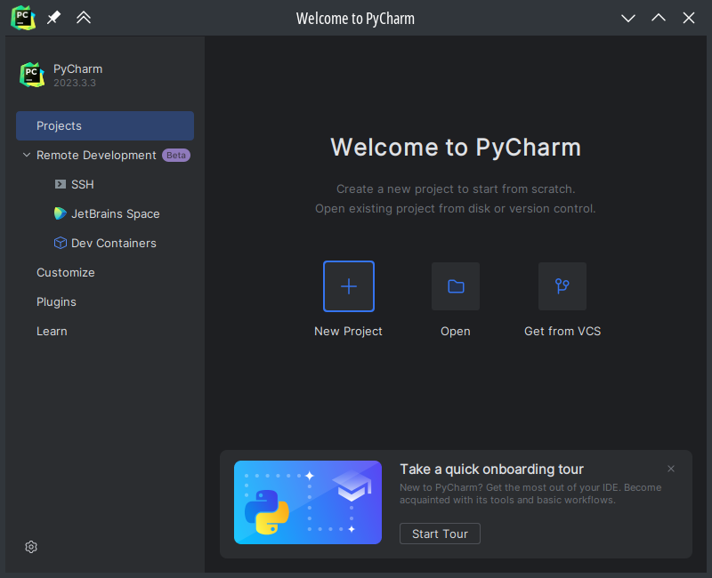
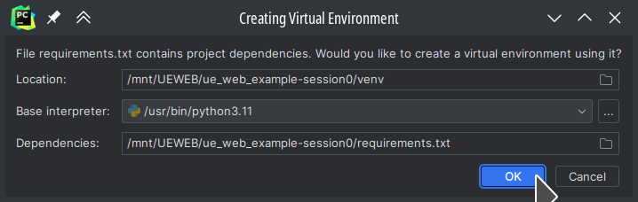

1. TOC
{:toc}

Dans le cas où vous ne disposeriez pas déjà d'un environnement de
développement Python, nous en installerons un dans cette session en utilisant le logiciel
[*miniconda*](https://docs.conda.io/en/latest/miniconda.html) pour
configurer rapidement un tel environnement. Si vous disposez déjà d'un
environnement Python fonctionnel, vous pouvez sauter cette étape.

# Installation d'un environnement Python avec Miniconda et PyCharm

## Installation de Miniconda

Avec votre navigateur, visitez [https://docs.conda.io/en/latest/miniconda.html](https://docs.conda.io/en/latest/miniconda.html) pour télécharger le programme d'installation qui correspond à votre configuration. Faites attention à choisir __Python 3.7 MINIMUM__. Normalement, la version actuelle est Python 3.11.

Il faut exécuter le programme d'installation sur votre machine. Au cours de l'installation, utilisez les paramètres par défaut. **Il est possible que le programme d'installation vous demande d'entrer un mot de passe administrateur. Dans ce cas, entrez le mot de passe de votre compte.**

Vous pouvez quitter le programme d'installation : Miniconda est maintenant installé sur l'ordinateur.

**Si l'installation n'a pas fonctionné correctement ou des messages d'erreur sont apparus, parlez-en à l'enseignant afin de ne pas prendre de retard sur la session.**

## Installation et configuration de PyCharm

Avec votre navigateur, visitez [https://www.jetbrains.com/pycharm/download](https://www.jetbrains.com/pycharm/download) pour télécharger le programme d'installation de "PyCharm" qui correspond à votre configuration.

Bien que la version *PyCharm Community* puisse être suffisante pour ce module, **nous vous conseillons vivement** de faire un compte sur le site [https://www.jetbrains.com/student/](https://www.jetbrains.com/student/) avec votre adresse email "imt-atlantique.net" et de récupérer ainsi gratuitement la version *PyCharm Professional*, cette dernière incluant un plug-in qui facilite beaucoup le développement d'un projet Flask.

Démarrez le programme d'installation récupéré sur le site [https://www.jetbrains.com/pycharm/download](https://www.jetbrains.com/pycharm/download), et continuez avec une installation utilisant les paramètres par défaut.

**Si l'installation n'a pas fonctionné correctement ou des messages d'erreur sont apparus, parlez-en à l'enseignant afin de ne pas prendre de retard sur la session.**

Une fois l'installation terminée avec succès, lancez "PyCharm". Vous devriez voir apparaitre un écran d'accueil qui ressemble à cela :

## Vérification de l'installation

Pour vérifier que l'installation de "PyCharm" et "Miniconda" est fonctionnelle, nous allons créer un projet basique. Sur l'écran d'accueil de "PyCharm", cliquez sur *create new project* :

Un écran vous demandant des renseignements sur le projet apparaitra :

Appliquez les actions suivantes:

1. Sélectionnez **Flask** comme type de projet
2. Entrez un nom de projet (*FlaskExample*)
3. Vérifier que le projet sera crée dans le bon repertoire
4. Choisissez d'utiliser un environnement « Custom »
5. Choisissez de créer un nouveau
6. Choisissez le type « Conda »
7. Choisissez la version du Python qui vient avec Miniconda
8. Validez la création du projet

PyCharm va configurer le nouveau projet et analyser votre installation de Python, **ce qui peut prendre quelques minutes**. 
Finalement, une fenêtre affichant le code du projet exemple apparaitra :

Nous allons lancer le projet afin de voir si **Python** et **Flask** sont bien installés. Pour cela, cliquez sur l'icône en forme d'insecte en haut à droite de la fenêtre PyCharm :

Une console devrait apparaitre en bas de votre fenêtre PyCharm:

Avec votre navigateur web, tapez l'[URL](https://fr.wikipedia.org/wiki/Uniform_Resource_Locator) indiquée dans la console : [http://127.0.0.1:5000](http://127.0.0.1:5000). Un texte devrait apparaitre dans le navigateur:

Si ce que vous obtenez correspond à la capture d'écran ci-dessus, alors votre environnement de développement est correctement configuré. 
**Si ce n'est pas le cas, demandez de l'aide à l'enseignant !**

### Fermer le projet
Pour fermer le projet, arrêtez d'abord le serveur en cours d'exécution en cliquant sur le carré rouge au-dessus de la console en bas :

Cliquez ensuite sur l'icône « hamburger » en haut à gauche de la fenêtre pour afficher le menu complet :

Enfin, cliquez sur « Fermer le projet » :

## Récupération d'un projet existant depuis une archive ZIP

Nous allons maintenant voir comment récupérer l'archive d'un projet Flask existant déjà fonctionnel. 
Le projet que nous récupérerons met en oeuvre les éléments qui seront introduits au cours des prochaines séances. 
Ce projet est hébergé sur la plateforme d'hébergement de code source [Github](https://github.com), mais nous récupérerons son code source sous forme d'archive, **le gestionnaire de version GIT n'est pas au programme de ce module**. 
Cependant, nous vous conseillons vivement de vous faire un compte sur Github, et de l'utiliser pour héberger vos futurs projets de développement logiciels.

Le projet d'exemple est hébergé sur Github, et une archive y est récupérable :
[https://github.com/TeachingAndResearch/ue_web_example/archive/session0.zip](https://github.com/TeachingAndResearch/ue_web_example/archive/session0.zip)

Nous vous demandons de:
1. Télécharger l'archive ZIP via le lien précédent
2. Extraire cette archive\

3. Sur la page d'accueil PyCharm, cliquer sur **ouvrir**

4. Sélectionner le dossier où vous avez extrait l'archive ZIP et cliquez sur OK

5. Cliquez sur OK pour créer un nouvel environnement virtuel pour le projet.

6. Attendre que PyCharm charge le projet. Cette opération peut prendre un certain temps, car les dépendances nécessaires doivent être installées à partir du réseau.
7. Lancer le projet comme avant. **Si vous rencontrez une erreur, prévenez l'enseignant!**

## Configuration du projet avec le mode _Flask_ et le mode _deboggage_

1. Cliquez à droite du nom du projet (la liste déroulante)

2. Cliquer sur **Edit Configurations ...**

3. Cliquer sur **Add New Configuration** (le icone **+**)

4. Sélectionner **Flask server**

5. Dans la page de configuration il faut faire les suivantes :
   - `1`. Sélectionner « Script path » 
   - `2`. Cliquer sur l'icone dossier et Sélectionner le fichier « `app.py` » dans le dossier du projet, puis cliquez OK.
   - `3`. Cocher « `FLASK_DEBUG` »
   - `4`. Vérifiez qu'un environment est sélectionné
   - `5`. Cliquez OK

6. Cliquez à droite du nom du projet (la liste déroulante)

7. Cliquez sur l'icône de l'insecte à droite du nom de la configuration d'exécution que vous venez de créer `Flask (app.py)`

8. Ceci exécutera le serveur en mode débogage, et une nouvelle console devrait s'ouvrir en bas. **Si une erreur apparait, contactez l'enseignant**

9. Cliquez ensuite sur l'URL dans la console. Un texte devrait apparaitre dans le navigateur.

