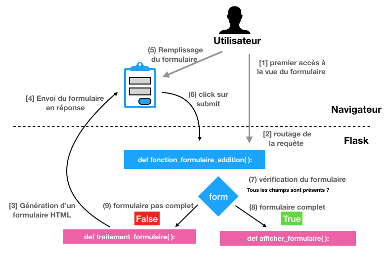
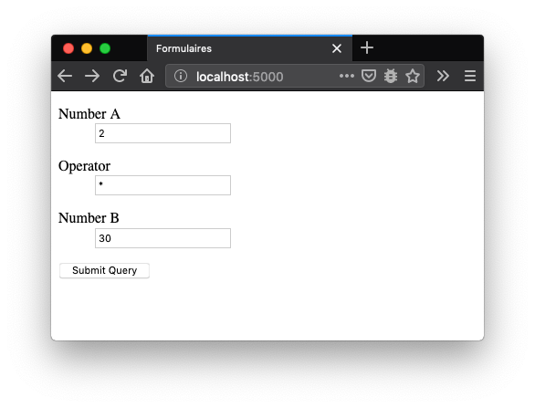
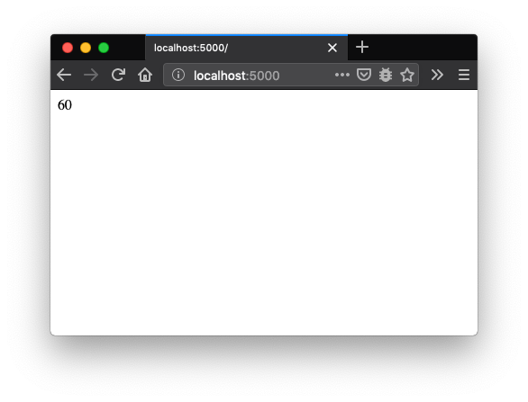
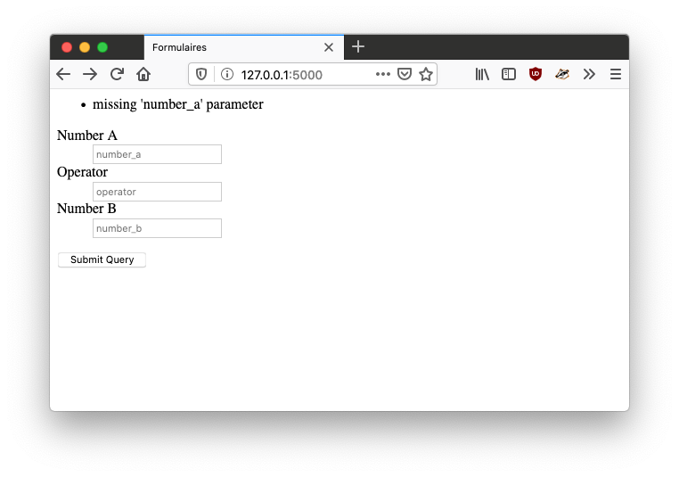
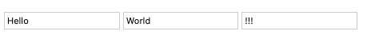
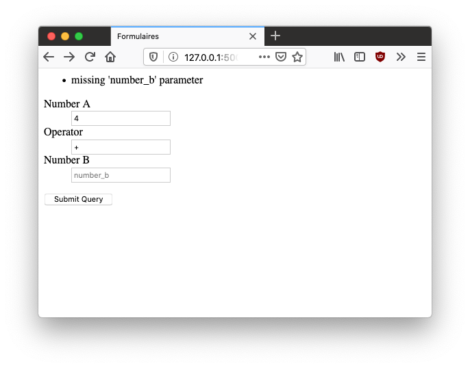
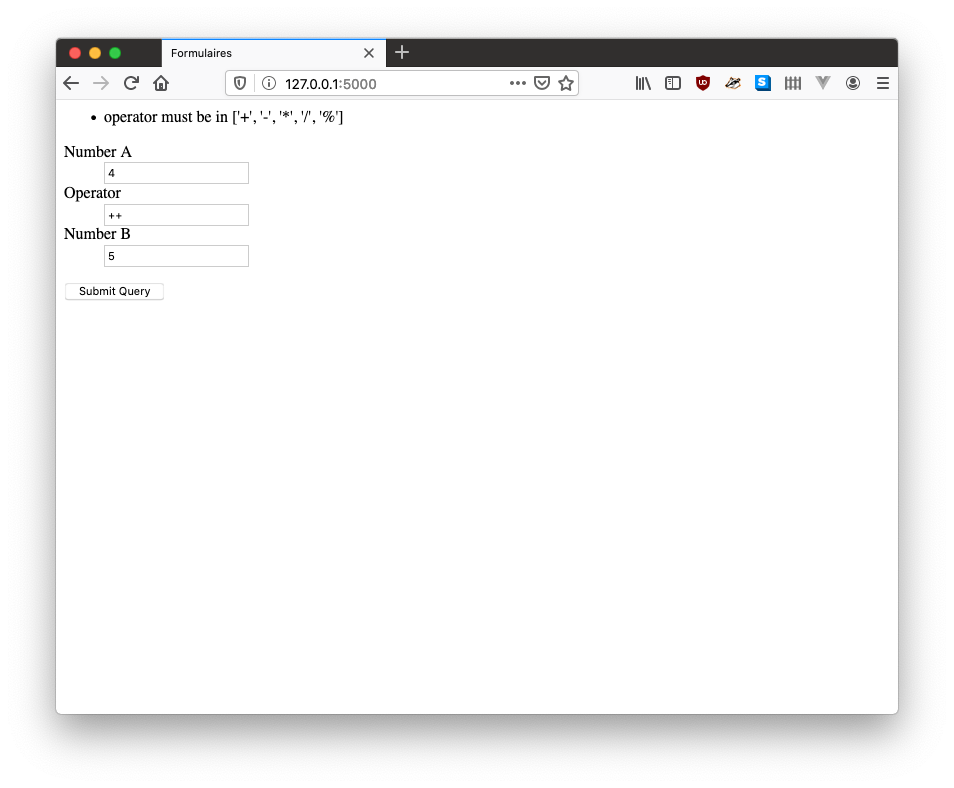

1. TOC
{:toc}


# Rappels sur les formulaires

Les formulaires sont une manière de demander de l'information aux
utilisateurs. Ils fonctionnent de la même manière que les formulaires
administratifs :

| Étape | Formulaire administratif | Formulaire Flask             |
|:--: |:------------------------------------|:------------------|
| `Développement`{: .label .label-blue} | | |
| 0 | Définition d'un formulaire (sous éditeur de texte)  | Définition d'une fonction Flask `fonction_formulaire` qui génère et traite un formulaire HTML |
| `Fonctionnement`{: .label .label-blue} | | |
| 1 | Un utilisateur entre dans un batiment administratif | Un utilisateur accède à une vue Flask via un navigateur web  |
| 2 | L'utilisateur se dirige vers un guichet où l'attend un agent administratif | Flask route la requête à la bonne fonction Python |
| 3 | L'agent imprime un nouveau formulaire  correspondant à la demande         |La fonction `fonction_formulaire` passe la main à passe à la main à `afficher_formulaire` qui  génère un formulaire HTML grâce à la template, et utilise l'état du formulaire pour préremplir les entrées |
| 4 | L'agent donne le formulaire à l'utilisateur | Flask retourne le formulaire HMTL à l'utilisateur  |
| 5 | **L'utilisateur remplit le formulaire** | **L’utilisateur remplit le formulaire** |
| 6 | L'utilisateur donne le formulaire à l'agent | L'utilisateur clique sur le bouton `submit` |
| 7 | L'agent vérifie les informations du formulaire | La fonction `fonction_formulaire` vérifie les informations du formulaire |
| `Si le formulaire est bien rempli`{: .label .label-green} | | |
| 8 | L'agent accepte le formulaire et prend en compte la demande | La fonction `fonction_formulaire` passe la main à passe à la main à `traitement_formulaire` qui va potentiellement faire des modifications en base de données |
| `Si le formulaire est mal rempli`{: .label .label-red} | | |
| 9 | Retour à l'étape 5 (voire 3) | Retour à l'étape 3 (en sauvegardant les informations entrées par l'utilisateur) |

De manière générale, pour implémenter correctement un formulaire avec
Flask nous écrirons trois fonctions Python :
* une fonction `fonction_formulaire` qui sera en charge de récupérer une requête HTTP et de faire appel à une des deux fonctions suivantes (étapes 1 à 3).
* une fonction `afficher_formulaire` qui affiche le formulaire (étapes 3 à 8) :
  * vide lors du premier essai de remplissage
  * prérempli lors des essais supplémentaires
* une fonction `traitement_formulaire` (étape 8) qui
  * traite les entrées du formulaire préalablement validé
  * redirige l'utilisateur une fois le traitement fait

L'image ci-dessus résume le fonctionnement du formulaire avec la convention précédemment décrite :


# Un formulaire pour calculer des expressions mathématiques

Dans cette section nous allons coder un formulaire qui permettra de
calculer des expressions mathématiques avec un formulaire. Le
formulaire ressemblera à cela:



En validant le formulaire figurant dans l'image précédente,
l'expression mathématique correspondante sera calculée, et le résultat
de son évaluation sera affiché comme suit:




## Récupération du projet à compléter


Avec votre navigateur, cliquez sur ce [lien vers formulaires.zip](https://github.com/TeachingAndResearch/ue_web_example/archive/formulaires.zip) permettant de démarrer cet exercice.

Ce projet une application Flask basique qu'il faudra compléter.

## Ajout du formulaire dans Flask

Dans le fichier `app.py`, Une fonction
`fonction_formulaire_addition` a été définie (l.28) : celle-ci est en charge de créer un formulaire et traiter les informations reçues depuis ce formulaire.
Le code est le suivant:

```python
@app.route("/add", methods=["GET", "POST"])
@app.route("/", methods=["GET", "POST"])
def fonction_formulaire_addition():
    form_est_valide, errors = formulaire_est_valide(flask.request.form)
    if not form_est_valide:
        return afficher_formulaire_addition(flask.request.form, errors)
    else:
        return traitement_formulaire_addition(flask.request.form)
```

Nous pouvons faire les observations suivantes:
- Il y a trois sous-fonctions appelées par la fonction `fonction_formulaire_addition`:
  - `formulaire_est_valide(form)`: cette fonction prend un objet `form` retourné par Flask et vérifie que le formulaire est valide, c'est à dire que tous les champs nécessaires ont bien été renseignés.
  - `afficher_formulaire_addition(form, errors)`: cette fonction prend un objet `form` et une liste de messages d'erreurs en entrée et affiche un formulaire HTML.
  - `traitement_formulaire_addition(form)`: cette fonction prend un objet `form` __valide__ en entrée et prend en compte ses données.

Le code de la fonction `traitement_formulaire_addition` est fourni:

```python
def traitement_formulaire_addition(form):
    expression = f"{form.get('number_a')} {form.get('operator')} {form.get('number_b')}"
    resultat = "%s" % eval(expression)
    return resultat
```

L'objectif de cette session va être de développer les fonctions `afficher_formulaire_addition` et `formulaire_est_valide`.

## Affichage du formulaire

Il faut définir la fonction `afficher_formulaire_addition` qui fait
appel à une template:

```python
def afficher_formulaire_addition(form, errors):
    return flask.render_template("form_addition.html.jinja2")
```

La template `templates/form_addition.html.jinja2` est définie de la
manière suivante:


``` jinja
<html>
    <head>
        <title>Formulaires</title>
    </head>
    <body>
    <form action="{{ url_for("fonction_formulaire_addition") }}" method="post">
        <dl>
            <dt>Number A</dt>
            <dd>
                <input type="text" name="number_a" placeholder="number_a">
            </dd>
            <dt>Operator</dt>
            <dd>
                <input type="text" name="operator" placeholder="operator">
            </dd>
            <dt>Number B</dt>
            <dd>
                <input type="text" name="number_b" placeholder="number_b">
            </dd>
        </dl>
        <input type="submit">
    </form>
    </body>
</html>
```


Nous pouvons faire les observations suivantes:
- Chaque champ du formulaire est affichée grâce à un appel du style `<input type="text" name="number_a" placeholder="number_a">`
- Dans chacun des champ du formulaire, on a un attribut `name="nom_du_champ"`. Cette attribut sera utilisé comme clé pour stocker la valeur dans `flask.request.form` : en effet dans cet exemple, la valeur du champ de formulaire qui a pour attribut `name="foo"` sera accessible à `flask.request.form["foo"]`.
- On indique où envoyer la template avec l'instruction  `action="{{ url_for("fonction_formulaire_addition") }}"`.
- Cette fonction `url_for` prend en paramètre le nom et les arguments d'une fonction python, et retourne une URL qui cible cette fonction. Pour en savoir plus sur `url_for`, référez-vous à la [documentation Flask](https://flask.palletsprojects.com/en/2.0.x/api/#flask.url_for).

## Validation du formulaire

La fonction de validation du formulaire doit vérifier chacun des champs obligatoire du formulaire et générer des messages d'erreurs lisibles permettant de comprendre ce qui ne va pas:

```python
def formulaire_est_valide(form):
    number_a = flask.request.form.get("number_a", "")
    number_b = flask.request.form.get("number_b", "")
    operator = flask.request.form.get("operator", "")

    result = True
    errors = []

    if number_a == "":
        result = False
        errors += ["missing 'number_a' parameter"]
    if number_b == "":
        result = False
        errors += ["missing 'number_b' parameter"]
    if operator == "":
        result = False
        errors += ["missing 'operator' parameter"]

    return result, errors
```

On peut noter que:
- les entrées d'un formulaire deviennent des attributs de l'objet `form` et sont accessibles sous forme d'attribut `flask.request.form["nom-de-l-entree"]`, comme montré précedemment grâce à l'attribut `name`.
- Ici, on vérifie uniquement que les champs sont remplis.

## Affichage de messages d'erreurs

La fonction `formulaire_est_valide` retourne deux résultats : un booléen indiquant si le formulaire est valide ainsi qu'une liste de messages d'erreurs permettant aux utilisateurs
de mieux comprendre ce qu'ils ont mal fait. Dans cette sous-section, nous allons voir comment intégrer ces messages dans la page d'affichage du formulaire.

Nous allons d'abord modifier la fonction `afficher_formulaire_addition` pour qu'elle à la template jinja2 la liste de messages d'erreurs sous la forme d'une variable `errors`:

```python
def afficher_formulaire_addition(form, errors):
    return flask.render_template("form_addition.html.jinja2", errors=errors)
```

Ajoutons ensuite le code suivant dans le template `form_addition.html.jinja2`:


```jinja

    Errors:
    <ul>
        
            <li>{{ error }}</li>
        
    </ul>

```


Cela devrait afficher un message d'erreur dans la page de création de formulaire:


C'est un progrès cependant, les valeurs déjà entrées par les
utilisateurs sont perdues, forçant les utilisateurs à les
re-entrer. Nous allons maintenant voir comment garder les valeurs de
formulaires renseignées par les utilisateurs.

## Mise en mémoire des valeurs déjà renseignées

La balise des formulaires html est de la forme `form` et contient
d'autres balises `input`. Les balises `input` acceptent un attribut
`value` qui permet de préremplir un champ.


```html
<input type="text" name="foo" placeholder="foo" value="Hello">
<input type="text" name="foo" placeholder="foo" value="World">
<input type="text" name="foo" placeholder="foo" value="!!!">
```




Pour garder les valeurs déja entrées par les utilisateurs, nous allons d'abord modifier la fonction `afficher_formulaire_addition` pour qu'elle passe le formulaire à la template:
```python
def afficher_formulaire_addition(form, errors):
    return flask.render_template("form_addition.html.jinja2",
                                 errors=errors,
                                 form=form)

```

Ensuite il faut modifier la template `form_addition.html.jinja2`:

```jinja
<form action="{{ url_for("fonction_formulaire_addition") }}" method="post">
        <dl>
            <dt>Number A</dt>
            <dd>
                <input type="text" name="number_a" placeholder="number_a" value="{{ form.number_a }}">
            </dd>
            <dt>Operator</dt>
            <dd>
                <input type="text" name="operator" placeholder="operator" value="{{ form.operator }}">
            </dd>
            <dt>Number B</dt>
            <dd>
                <input type="text" name="number_b" placeholder="number_b" value="{{ form.number_b }}">
            </dd>
        </dl>
        <input type="submit">
</form>
```




## (bonus) Sécurisation du formulaire

Il est possible de sécuriser un peu plus les entrées du formulaire en ajoutant cette vérification dans le code de `formulaire_est_valide`:

```python
authorized_operators = ["+", "-", "*", "/", "%"]
if operator not in authorized_operators:
    result = False
    errors += [f"operator must be in {authorized_operators}"]
```


