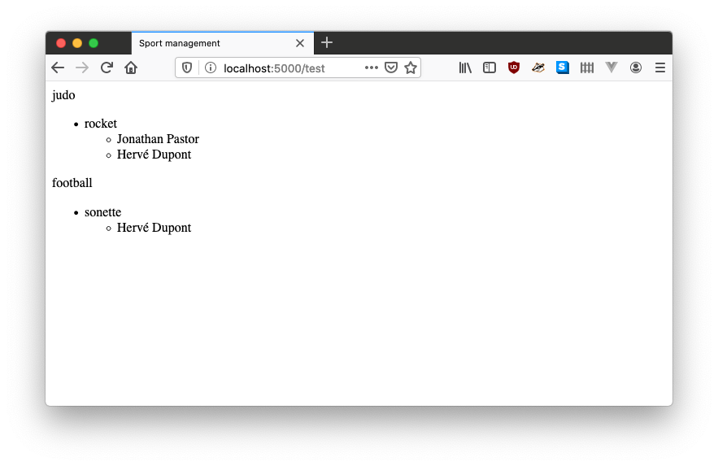

1. TOC
{:toc}


Dans cette session nous verrons comment manipuler une base de données
relationnelle avec
l'[ORM](https://fr.wikipedia.org/wiki/Mapping_objet-relationnel)
SQLAlchemy.

Dans les sessions précédentes, certains exemples utilisaient déjà une
base de données, cependant l'équipe enseignante avait décidé qu'elle
serait masquée : il vous était demandé de manipuler les données (lire
les données de la base de données) en utilisant des fonctions python
qui s'occupaient d'interroger la base de données.

Pour bien illustrer ces étapes, nous démarrerons cette session à
partir d'une archive ZIP
[tp_bdd_tasks_start.zip](https://github.com/TeachingAndResearch/ue_web_example/archive/tp_bdd_tasks_start.zip)
contenant un projet minimal, sans base de données. Dans les sections
suivantes, nous ajouterons progressivement le support des bases de
données. Enfin, nous ferons un exercice qui se basera sur le
code écrit pendant la session. Il sera aussi possible de démarrer
d'une archive ZIP. La correction se trouve en fin de ce document.

# Mise en place d'une connexion avec une base de données

Tout d'abord, ajouter cette ligne (si elle n'est pas déjà présente) dans le fichier `requirements.txt`:
```
flask-sqlalchemy
```

Cela indique à votre environnement de développement (PyCharm dans
notre cas) qu'il faut que la bibliothèque `flask-sqlalchemy` doit être
disponible dans notre application Flask.

Ensuite, créer un dossier `database` à la racine de votre dossier
d'application Flask, et créer un fichier `database/database.py` avec
le contenu suivant:

```python
from flask_sqlalchemy import SQLAlchemy

db = SQLAlchemy()


def init_database():
    db.create_all()
```

Ce fichier fait les choses suivantes:
- une variable public `db` qui contient un objet initialisé avec une instance de l'ORM SQLAlchemy.
- une fonction `init_database`, dont l'appel initialise le modèle de données défini par l'application Flask (création des tables, initialisation des clés étrangères, contraintes de bases de données, etc)

Nous allons maintenant prendre en compte SQLAlchemy dans notre application. Pour cela, faites les modifications suivantes dans le fichier `app.py`:

1. en début de fichier, ajouter l'import suivant:
```python
from database.database import db, init_database
```
2. après la définition de la variable `app`, ajouter les lignes suivantes:
```python
db.init_app(app) # (1) flask prend en compte la base de donnee
with app.test_request_context(): # (2) bloc exécuté à l'initialisation de Flask
    init_database()
```

Ce que nous venons de faire, c'est de faire prendre conscience à Flask
que la base de données existe, et nous avons demandé à Flask
d'initialiser la base de données quand l'application est démarrée.

Si nous lancions Flask avec seulement ces lignes:
- la base de données serait stockée à un endroit inconnu sur l'ordinateur
- quelques messages d'avertissement apparaitraient dans la console

Pour résoudre ces deux points, ajouter les instructions suivantes dans
le fichier `app.py`, juste après la définition de la variable `app`:

```python
app.config["SQLALCHEMY_DATABASE_URI"] = "sqlite:///database/database.db"
app.config["SQLALCHEMY_TRACK_MODIFICATIONS"] = False
```

# Définition de classes "Modèle"

Avec SQLAlchemy, il n'y a pas besoin de définir des tables avec des
instructions SQL. A la place, on définit des classes Python qui
étendent `db.Model` et on y ajoute des attributs utilisant la classe
`db.Column`, dont le premier argument définit le type de l'attribut,
et les autres arguments définissent des contraintes.

Dans cet exercice, nous allons définir une classe tâche. Créer le
fichier `database/models.py`, et y mettre le code suivant:

```python
from database.database import db

class Task(db.Model):
    id = db.Column(db.Integer, primary_key=True)
    label = db.Column(db.Text)
    isDone = db.Column(db.Boolean)
```

Une liste non exhaustive des types disponibles est:
- `Integer`: entier
- `Float`: nombre réel
- `String(size)`: chaine de caractère avec pour taille maximale `size`
- `Text`: texte sans limites de taille
- `DateTime`: stockage d'une date-heure ([datetime](https://docs.python.org/3/library/datetime.html#datetime.datetime))
- `Boolean `: booléen
- `PickleType`: stockage d'un objet python
- `LargeBinary`: stockage d'un objet binaire (fichier)

Vous trouverez plus d'informations sur les types disponibles et
comment les utiliser avec ce lien vers la documentation de
[flask-sqlalchemy](https://flask-sqlalchemy.palletsprojects.com/en/2.x/models/#simple-example).

# Ajouter, modifier et supprimer des données

L'ORM `SQLAlchemy` introduit le concept de
[Session](https://docs.sqlalchemy.org/en/13/orm/session_basics.html),
qui sert de tampon entre la base de données et les données que
l'application Flask manipule. Une session sera utilisée en particulier
pour ajouter/modifier et supprimer des données.

On peut utiliser la fonction `session.add` pour:

- 1) ajouter un nouvel objet en base de données

```python
from database.database import db

# Creation d'une nouvelle tache. Elle n'est visible que localement
new_task = Task(label="tache1", isDone=False)

# Ajout de la tache dans la base de donnees
db.session.add(new_task)
db.session.commit() # Sauvegarde les informations dans la base de donnees

```

- 2) modifier un objet existant

```python
# Modification d'une tache
existing_task.isDone = not existing_task.isDone # On inverse l'etat d'une tache
db.session.add(existing_task)
db.session.commit() # Sauvegarde les informations dans la base de donnees
```

et la fonction `session.delete` permet de supprimer un objet de la base de données:
```python
# Suppression d'une tache
db.session.delete(existing_task)
db.session.commit() # Sauvegarde les informations dans la base de donnees
```

# Sélectionner et filtrer des données

Plutôt que d'écrire des requêtes en langage SQL, SQLAlchemy propose de sélectionner et filtrer les informations de la base de données en utilisant des fonctions python:


| Action        | Code         | type de retour |
|:-------------|:------------------| :-----  |
| Lister toutes les tâches  | `Task.query.all()` | `list<Task>` |
| Récupérer le premier élément des résultats d'une requête | `Task.query.first()` | `Task` ou `None` |
| Tâches qui ne sont pas finies | `Task.query.filter_by(isDone=False).all()` | `list<Task>` |
| Tâche qui correspond à un identifiant | `Task.query.filter_by(id=task_id).first() ` | `Task` ou `None` |
| Sélection des paires d'attributs `label` et `isDone` | `db.session.query(Task.label, Task.isDone).filter_by(isDone=False).all()` | `list<tuple(str, bool)>` |
| Sélection des paires d'attributs `label` et `isDone`, distinctes | `db.session.query(Task.label, Task.isDone).filter_by(isDone=False).distinct().all()` | `list<tuple(str, bool)>` |

# Mise en place de relations entre classes "Modèle"

En SQL il est possible de définir des [clés
étrangères](https://fr.wikipedia.org/wiki/Cl%C3%A9_%C3%A9trang%C3%A8re)
qui permettent de définir des relations entre différentes tables.
Un exemple de relation serait : un cours est associé à une salle, un ou
plusieurs professeurs (et plusieurs élèves). Le cours ferait alors référence
à la salle, et la salle ferait référence à un ou plusieurs cours. De même,
un cours ferait référence à un ou plusieurs professeurs, tandis qu'un
professeur ferait référence à un ou plusieurs cours (de même pour les
élèves).

Il est possible de faire la même chose avec `SQLAlchemy`, en définissant des relations. Il existe principalement 2 types de relations:
- `OneToMany`: les classes A et B sont liées, un élément de A peut avoir plusieurs B, mais un élément de B ne peut avoir au maximum qu'un A. Dans l'exemple précédent, la relation "salle-cours" est de type OneToMany.
- `ManyToMany`: les classes A et B sont liées, un élément de A peut avoir plusieurs B, et un élément de B peut avoir plusieurs A. Dans l'exemple précédent, les relations "professeur-cours" et "élève-cours" sont de type ManyToMany.

Traditionnellement, les relations "ManyToMany" étaient implémentées avec des tables d'association, comme il est montré dans ce lien de [la documentation de SQLAlchemy](https://docs.sqlalchemy.org/en/13/orm/basic_relationships.html#many-to-many).

Nous allons utiliser un exemple sportif où des joueurs font parties d'équipes de sport, chaque équipe étant associée à un sport.
Nous aurons les arités suivantes:
- Une joueur appartient à une ou plusieurs équipes
- Chaque équipe comprend 0, 1, n joueurs
- Chaque équipe est associée à un sport
- Un sport peut être associé à plusieurs équipes

Nous avons donc deux relations:
- une relation OneToMany entre sport et équipe.
- une relation ManyToMany entre joueurs et équipes.

Vous pouvez récupérer une archive de code [tp_relations_flask.zip](https://github.com/TeachingAndResearch/ue_web_example/archive/tp_relations_flask.zip),
qui contient le code correspondant à cet exemple.

Dans le fichier `database.py` le modèle est défini de la manière suivante:
```python
class Sport(db.Model):
    id = db.Column(db.Integer, primary_key=True)
    name = db.Column(db.Text)


junction_table = db.Table('participation',
   db.Column('team_id', db.Integer, db.ForeignKey('team.id')),
   db.Column('player_id', db.Integer, db.ForeignKey('player.id')),
)


class Team(db.Model):
    id = db.Column(db.Integer, primary_key=True)
    name = db.Column(db.Text)
    sport_id = db.Column(db.Integer, db.ForeignKey('sport.id'))
    sport = db.relationship('Sport', backref='teams')  # Sport <-> Team relationship
    players = db.relationship('Player', backref='teams', secondary=junction_table)  # Sport <-> Player relationship


class Player(db.Model):
    id = db.Column(db.Integer, primary_key=True)
    firstname = db.Column(db.Text)
    lastname = db.Column(db.Text)
```
Nous pouvons constater les choses suivantes:
- Trois classes `Sport`, `Team` et `Player` sont définies: elles correspondent aux concepts evoqués plus haut.
- Les relations entre classes se définissent en spécifiant des attributs `db.relationship`
- Les attributs  `db.relationship` peuvent prendre un paramètre `backref` qui créera un attribut sur la classe cible.

On peut utiliser ce modèle de la manière suivante (code déjà présent dans `app.py`):
```python
# Create two sports
judo = Sport(name="judo")
football = Sport(name="football")
db.session.add(judo)
db.session.add(football)
db.session.commit()

# Create three players
player1 = Player(firstname="Jonathan", lastname="Pastor")
player2 = Player(firstname="Hervé", lastname="Dupont")
player3 = Player(firstname="André", lastname="Laroute")
db.session.add(player1)
db.session.add(player2)
db.session.add(player3)
db.session.commit()

# Create a team with the two players
rocket = Team(name="rocket", sport=judo)
sonette = Team(name="sonette", sport=football)
db.session.add(rocket)
db.session.add(sonette)
db.session.commit()

# Add the two players to the team 'rocket'
rocket.players.append(player1)
rocket.players.append(player2)
db.session.add(rocket)
sonette.players.append(player2)
sonette.players.append(player3)
db.session.commit()

# Fetch all sports
sports = Sport.query.all()
```

A parti de l'exemple récupéré avec l'archive [tp_relations_flask.zip](https://github.com/TeachingAndResearch/ue_web_example/archive/tp_relations_flask.zip)
en allant sur l'URL [http://localhost:5000/test](http://localhost:5000/test), vous devriez avoir le résultat suivant:


# Manipulation de dates

Il est possible de stocker des dates dans les classes modèles en
utilisant le type `db.DateTime`. L'exemple suivant propose d'ajouter
la notion de tournoi possédant un attribut `date` de type `db.Datetime`:

```python
class Tournament(db.Model):
    id = db.Column(db.Integer, primary_key=True)
    name = db.Column(db.Text)
    date = db.Column(db.DateTime)
```

Il est possible de créer un tournoi et de faire des requêtes portant sur les colonnes date. L'exemple suivant illustre la création d'un tournoi et son stockage en base de données:

```python
# Create Tournaments
import datetime
now = datetime.datetime.now()
one_hour_ago = now - datetime.timedelta(0, hours=1)

tournament = Tournament(name="tournament1", date=one_hour_ago)
db.session.add(tournament)
db.session.commit()
```

Puis en utilisant la méthode `filter`, il est alors possible de faire des requêtes portant sur une colonne stockant des dates, comme dans l'exemple suivant:
```
one_tournament_1 = Tournament.query.filter(Tournament.date > now - datetime.timedelta(0, hours=24)).all()
one_tournament_2 = Tournament.query.filter(Tournament.date > now - datetime.timedelta(0, minutes=24)).all()
one_tournament_3 = Tournament.query.filter(Tournament.date > now).all()
```

Enfin, il est possible de faire des requêtes plus complexes au moyen de la méthode `filter`. Cette [page](http://www.leeladharan.com/sqlalchemy-query-with-or-and-like-common-filters) donne un aperçu des possibilités offertes par la méthode `filter`, tandis que la [documentation SQLAlchemy](https://docs.sqlalchemy.org/en/13/orm/query.html) est plus complète.
